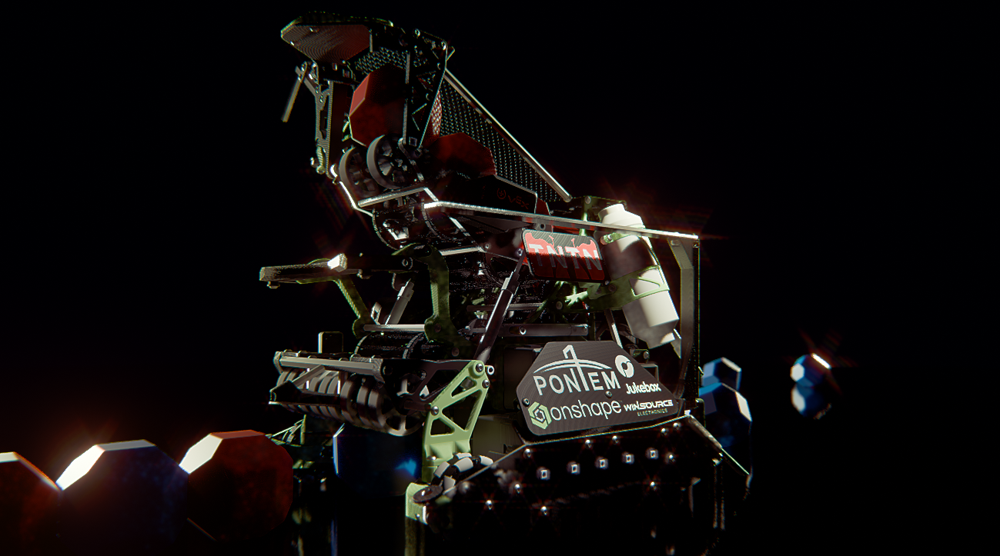

#  About Me:
  SFU Systems Engineering   TNTN Robotics Founding Member https://tntnvex.com/  

## 🌐 Socials:
  

  <h3>TNTN 2025 Robot Reveal Video</h3>
  

    

  <h3>TNTN 2025 Robot Autonomous</h3>
  

## Project Showcase
*Click an image to expand*

<table align="center">
  <tr>
    <td align="center" valign="top" width="33%">
      
       <b>2026-1</b> <i>Prototype A</i>
    </td>
    <td align="center" valign="top" width="33%">
      
       <b>Worlds 2025</b> <i>Won World Championship</i>
    </td>
    <td align="center" valign="top" width="33%">
      
       <b>Worlds 2025</b> <i>All 3 Major Awards</i>
    </td>
  </tr>

  <tr><td colspan="3" height="30px"></td></tr>

  <tr>
    <td align="center" valign="top" width="33%">
      
       <b>Worlds 2024</b> <i>First Year Uni Level</i>
    </td>
    <td align="center" valign="top" width="33%">
      
       <b>Worlds 2023</b> <i>Provincial Champion + Rank 1 NA</i>
    </td>
    <td align="center" valign="top" width="33%">
      
       <b>Worlds 2022</b> <i>First World Championship</i>
    </td>
  </tr>
  
  <tr>
    <td colspan="3" align="center" valign="top">
        
       
       <b>Dec 2020</b> <i>Early Learning / Rapid Growth</i>
    </td>
  </tr>
</table>

---

# 💻 Tech Stack:
    
